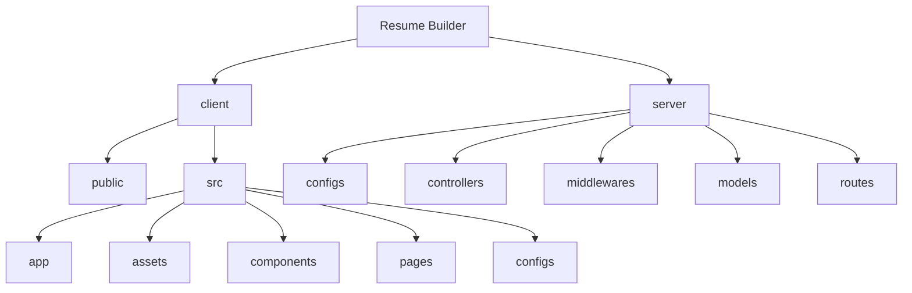
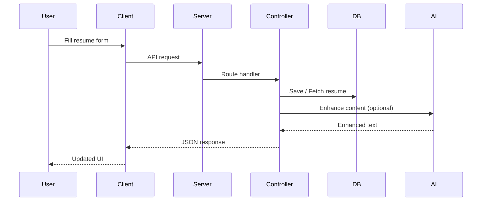

---

# 📄 Resume Builder

**Resume Builder** is a full-stack web application that allows users to create, customize, enhance, preview, and share professional resumes.

It features a modern **React + Redux (Vite)** frontend, a **Node.js + Express + MongoDB** backend, and **AI-powered resume content enhancement**.

The project is designed with **clean architecture, modular structure, and real-world usability** in mind.

---

## 🚀 Features

### 🔐 Authentication & User Management

* User registration and login
* JWT-based authentication
* Protected routes using middleware
* Global authentication state managed via Redux
* Secure logout handling

---

### 📊 Dashboard

* View all resumes created by a user
* Create new resumes
* Edit resume titles
* Delete resumes with confirmation
* Toggle resume visibility (public / private)
* Toast notifications for success and error states

---

### 🛠 Resume Builder

* Section-based resume creation:

  * Personal Information
  * Professional Summary
  * Experience
  * Education
  * Skills
  * Projects
* Smooth navigation between sections
* Accent color customization
* Resume template selection
* Auto-save with backend synchronization

---

### 🎨 Resume Templates

* Classic
* Minimal
* Modern
* Minimal Image
* FAANGPath
* Live resume preview

---

### 🤖 AI-Powered Enhancements

* AI-based **Professional Summary Enhancement**
* AI-based **Job Description Enhancement**
* Loader states during AI processing
* Backend-driven AI APIs

---

### 🖼 Image Upload & Processing

* Profile image upload
* ImageKit integration
* Multer-based file handling

---

### 🔗 Resume Preview & Sharing

* Public resume preview page
* Shareable resume link
* Resume download support

---

## 🛠 Tech Stack

### Frontend

* React (Vite)
* Redux Toolkit
* React Router
* Tailwind CSS
* Lucide Icons

### Backend

* Node.js
* Express.js
* MongoDB (Mongoose)
* JWT Authentication
* ImageKit
* AI APIs

---

## 🗂 Project Structure

### High-Level Architecture



---

### Folder Structure

```
resume-builder/
│
├── client/
│   ├── public/
│   │   ├── favicon.ico
│   │   └── logo.svg
│   │
│   ├── src/
│   │   ├── app/
│   │   │   ├── features/
│   │   │   │   └── authSlice.js
│   │   │   └── store.js
│   │   │
│   │   ├── assets/
│   │   │   ├── assets.js
│   │   │   ├── dummy_profile.png
│   │   │   ├── favicon.ico
│   │   │   └── logo.svg
│   │   │
│   │   ├── components/
│   │   │   ├── home/
│   │   │   │   ├── Banner.jsx
│   │   │   │   ├── CallToAction.jsx
│   │   │   │   ├── Features.jsx
│   │   │   │   ├── Footer.jsx
│   │   │   │   ├── Hero.jsx
│   │   │   │   ├── Testimonial.jsx
│   │   │   │   └── Title.jsx
│   │   │   │
│   │   │   └── templates/
│   │   │       ├── ClassicTemplate.jsx
│   │   │       ├── FAANGPathTemplate.jsx
│   │   │       ├── MinimalImageTemplate.jsx
│   │   │       ├── MinimalTemplate.jsx
│   │   │       └──  ModernTemplate.jsx
│   │   │   
│   │   ├── ColorPicker.jsx
│   │   ├── EducationForm.jsx
│   │   ├── ExperienceForm.jsx
│   │   ├── Loader.jsx
│   │   ├── Navbar.jsx
│   │   ├── PersonalInfoForm.jsx
│   │   ├── ProfessionalSummaryForm.jsx
│   │   ├── ProjectForm.jsx
│   │   ├── ResumePreview.jsx
│   │   ├── SkillsForm.jsx
│   │   └── TemplateSelector.jsx
│   │   │
│   │   ├── configs/
│   │   │   └── api.js
│   │   │
│   │   ├── pages/
│   │   │   ├── Dashboard.jsx
│   │   │   ├── Home.jsx
│   │   │   ├── Layout.jsx
│   │   │   ├── Login.jsx
│   │   │   ├── Preview.jsx
│   │   │   └── ResumeBuilder.jsx
│   │   │
│   │   ├── App.jsx
│   │   ├── index.css
│   │   └── main.jsx
│   │
│   ├── .env
│   ├── eslint.config.js
│   ├── index.html
│   ├── package-lock.json
│   ├── package.json
│   ├── README.md
│   └── vite.config.js
│
├── server/
│   ├── configs/
│   │   ├── ai.js
│   │   ├── db.js
│   │   ├── imageKit.js
│   │   └── multer.js
│   │
│   ├── controllers/
│   │   ├── aiController.js
│   │   ├── resumeController.js
│   │   └── userController.js
│   │
│   ├── middlewares/
│   │   └── authMiddleware.js
│   │
│   ├── models/
│   │   ├── Resume.js
│   │   └── User.js
│   │
│   ├── routes/
│   │   ├── aiRoutes.js
│   │   ├── resumeRoutes.js
│   │   └── userRoutes.js
│   │
│   ├── .env 
│   ├── package-lock.json
│   ├── package.json
│   └── server.js
│
└── README.md
```

---

## ⚡ API Flow Diagram



---

## ⚡ API Endpoints

### 🔐 Authentication (`/api/users`)

* `POST /register` → Register user
* `POST /login` → Login user
* `GET /date` → Get user data
* `GET /resumes` → Get user resumes

---

### 📄 Resume (`/api/resumes`)

* `POST /create` → Create resume
* `PUT /update` → Update resume
* `DELETE /delete/:resumeId` → Delete resume
* `GET /get/:resumeId` → Get resume by ID
* `GET /public/:resumeId` → Get public resume by ID

---

### 🤖 AI (`/api/ai`)

* `POST /enhance-pro-sum` → Enhance professional summary
* `POST /enhance-job-desc` → Enhance job descriptions
* `POST /upload-resume` →  Extract data from uploaded resume 

---

## 🔐 Security & Best Practices

* JWT-protected routes
* Centralized authentication middleware
* Controlled resume visibility
* Clean error handling
* Redux-managed authentication state

---

## ⚙️ Installation & Setup

```bash
# Clone repository
git clone https://github.com/your-username/resume-builder.git
cd resume-builder

# Run client
cd client
npm install
npm run dev

# Run server in another terminal window
cd server
npm install
npm run server
```

---

## 👨‍💻 Author

Developed by **Gurpreet Singh** ✨

*A modern, AI-powered resume builder demonstrating full-stack development, clean architecture, and real-world product thinking.*

---